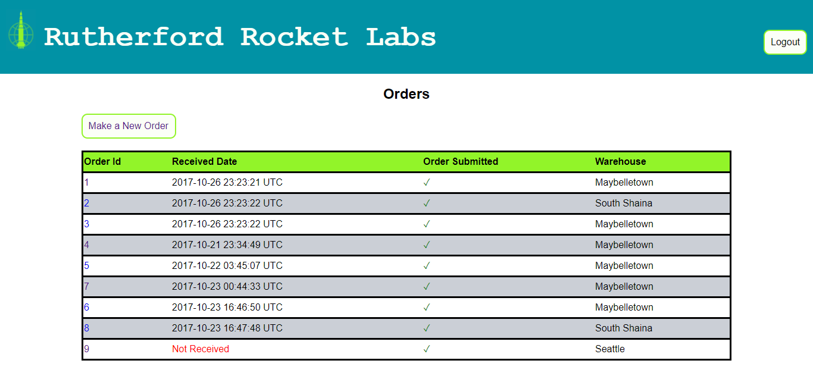

# mjdm-rockets

## Rutherford Rockets Inventory Website

Created in three days as a Dev Bootcamp project for a mock client, Rutherford Rocket Labs. The website tracks inventory and allows placing and receiving orders for rocket parts. Management-level employees can create accounts for new employees, create new warehouses, and update part information.

### Running Locally

Clone the repository and `bundle install`. Optionally, also `bundle exec rails db:seed` for seed data.

### Screenshots

Login/homepage of website

View company-wide inventory

View and create orders

Receive an order

### Team

* Devin Miller
* Miguel Ibarra
* Marlo Ito
* John Simoni

### User Stories

* As an employee I can login
* As an employee I can view inventory
  * Quantity/max
* As an employee I can remove items from inventory
* As an employee I can receive orders
  * Mark quantities received
  * See discrepancies
  * Update inventory (automatically)
* As a manager I can make a new order
  * Input parts and see the current quantity
  * Input a quantity of parts to order and be notified if it's over max
* As a manager I can create employee accounts
